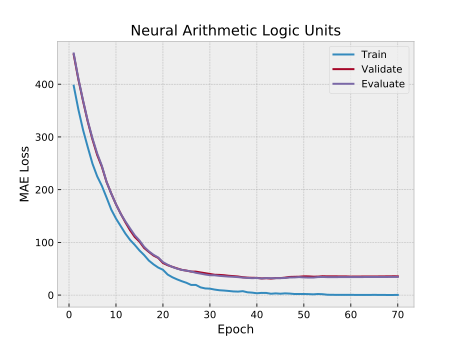
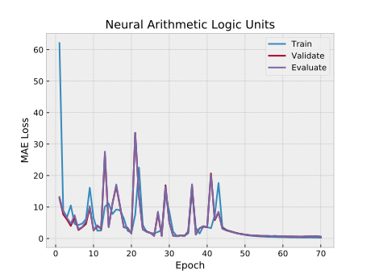

# NALU - Language to Number
Basic `PyTorch` implementation of
[Neural Arithmetic Logic Units](https://arxiv.org/abs/1808.00508)
by _Andrew Trask, Felix Hill, Scott Reed, Jack Rae, Chris Dyer and Phil Blunsom_.
- _**4.1**_ Simple Function Learning Tasks
- _**4.3**_ Language to Number Translation Tasks

## Installation
`git clone https://github.com/kerryeon/nalu`
or download

## Requirements
1. `Python` >= 3.6
2. `PyTorch` >= 0.4
3. `num2words` _from pip_

## Experiments
    python ./test/simple_function.py
    python ./test/language_to_number.py

## Train TIP
| Language to Number | Layer Size | Learning Rate |            Plot             |
|--------------------|:----------:|:-------------:|:---------------------------:|
|      LSTM (en)     |     32     |      0.01     |  |
|      NALU (en)     |     32     |      0.01     |  |

## Reference Source
Basic pytorch implementation _from bharathgs_ : https://github.com/bharathgs/NALU

## TODO
- [ ] More Languages
    - [x] English
    - [x] Korean
    - [x] Japanese
    - [x] Roman
    - [x] Mayan
- [x] Shuffle Dataset
- [ ] Furthermore
    - [ ] _**4.2**_ MNIST Counting and Arithmetic Tasks
    - [ ] _**4.4**_ Program Evaluation
    - [ ] _**4.5**_ Track Time in a Grid-World Environment
- [ ] Simplify code
- [ ] Comments
